# Lab Title: Configuring High Availability for Linux Virtual Machines with Availability Sets

## Lab Overview

In this hands-on lab, you will learn how to configure an Availability Set in Azure for Linux Virtual Machines (VMs). By distributing VMs across fault and update domains, Availability Sets help ensure high availability, minimizing downtime during maintenance events and hardware failures. This lab will guide you through the necessary steps to implement an Availability Set, deploy Linux VMs, and ensure they are fault-tolerant.

## Pre-requisites

- An active Azure subscription with sufficient permissions to create resources.
- Basic knowledge of Linux Virtual Machines and the Azure Portal.
- Access to the Azure CLI and/or Azure Portal.

## Learning Objectives

By the end of this lab, you will be able to:

- Understand the purpose and benefits of Availability Sets in Azure.
- Create and configure an Availability Set for Linux VMs.
- Deploy Linux Virtual Machines into an Availability Set.
- Gain insight into how fault and update domains contribute to high availability.

## Lab Description

This lab walks you through the process of setting up an Availability Set for Linux Virtual Machines in Azure, which ensures fault tolerance and minimizes downtime during maintenance. You will create an Availability Set, deploy a Linux VM into it, and understand the role of fault and update domains in ensuring high availability.

## TASKS

### Task 1: Create an Availability Set

**Objective:** Create an Availability Set in Azure to distribute VMs across fault and update domains.

**Instructions:**

1. Navigate to the Azure Portal.
2. In the search bar, type Availability Set and select Create.
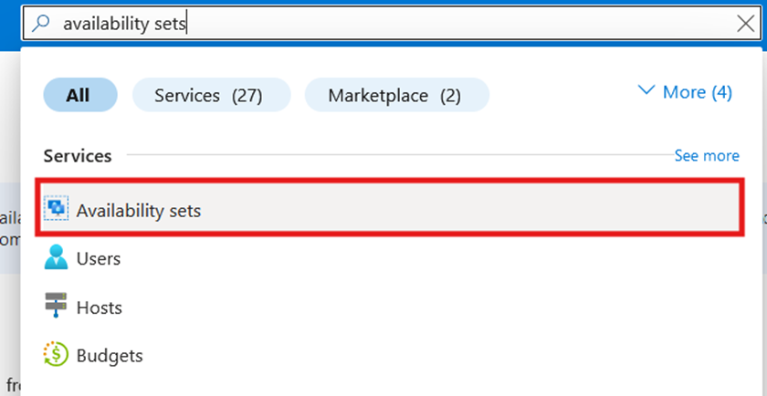
3. Enter the required details:
    - **Subscription:** Choose your active subscription.
    - **Resource Group:** Select an existing resource group or create a new one.
    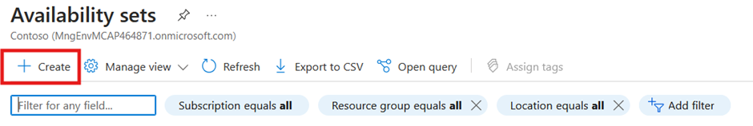
    - **Name:** Provide a unique name for the availability set (e.g., Linux-AvailSet).
    - **Region:** Select the region where you want to deploy the resources.
    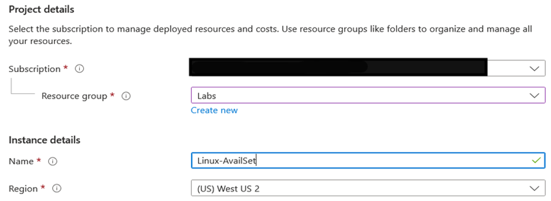
    - **Fault Domains:** Choose 2 (default value) to ensure high availability across multiple fault domains.
    - **Update Domains:** Select 5 (default value) to distribute updates across five domains to minimize downtime.
    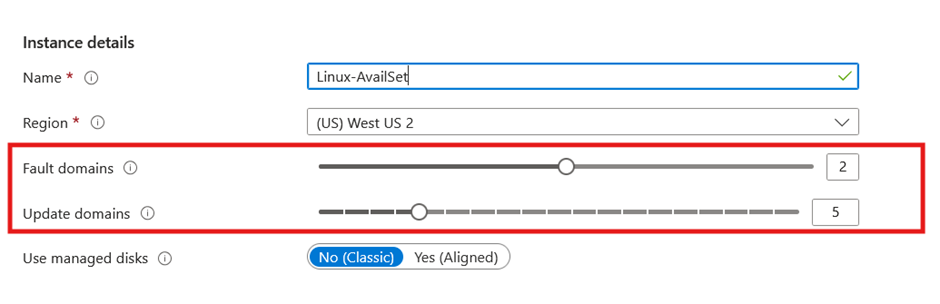
    - **Align Virtual Machines:** Leave as No unless you're using proximity placement groups.
4. Click Review + Create, then select Create to provision the Availability Set.
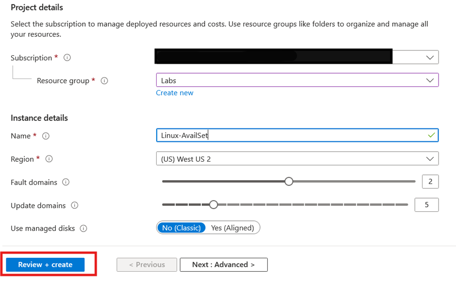

### Task 2: Deploy a Linux Virtual Machine into the Availability Set

**Objective:** Deploy a Linux VM into the Availability Set created in Task 1

**Instructions:**

1. In the Azure Portal, search for Virtual Machines and click Create.
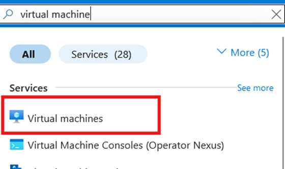
2. Select Azure Virtual Machine and fill in the basic details:
    - **Subscription:** Choose the same subscription as Task 1.
    - **Resource Group:** Select the resource group used in Task 1.
    - **Virtual Machine Name:** Enter a name for your VM (e.g., LinuxVM-01).
    - **Region:** Ensure this matches the region of the Availability Set.
    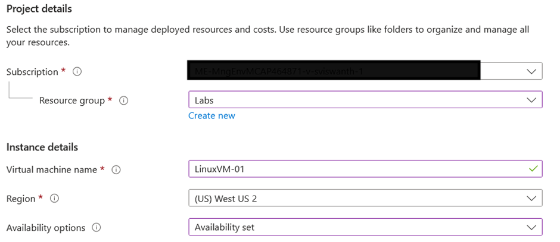
    - **Availability Options:** Select Availability Set.
    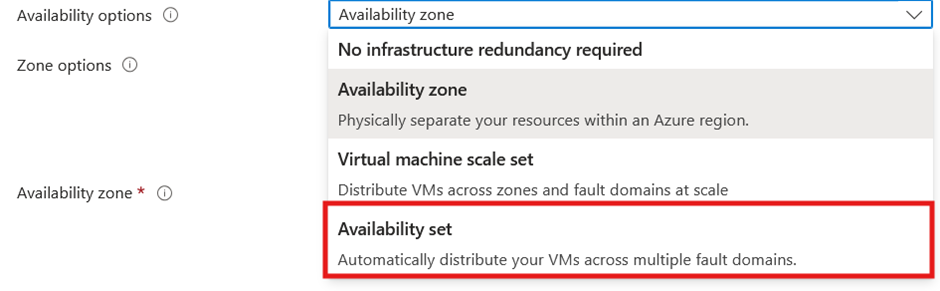
    - **Availability Set:** Choose the availability set created in Task 1.
    - **Image:** Select a Linux OS image, such as Ubuntu Server 24.04 LTS.
    - **Size:** Choose a VM size, such as Standard B1s.
    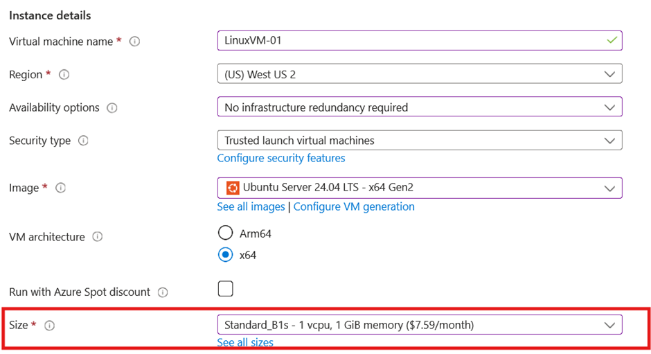
    - **Authentication Type:** Select SSH Public Key or Password, depending on your preferred authentication method.
    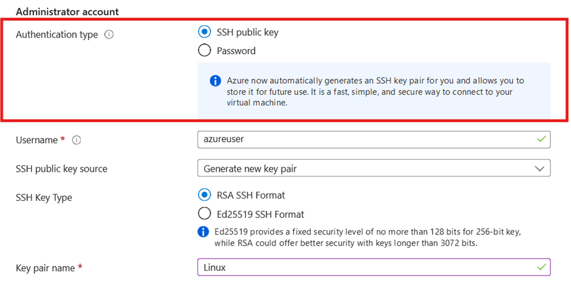
3. Complete the configuration for networking, management, and any additional settings.
4. Click Review + Create,Create to deploy the VM.
5. click on download private key and create resource 
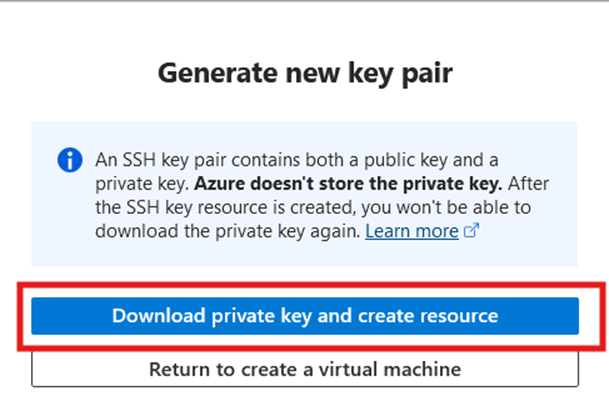

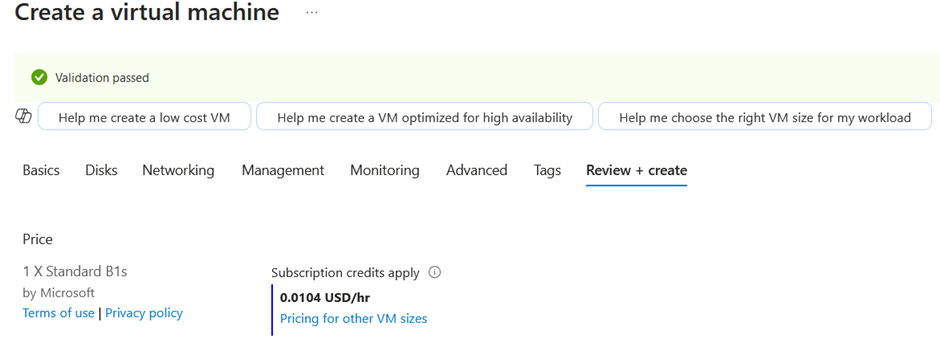

### Task 3: Verify the Deployment

**Objective:** Confirm that the Availability Set and VM have been configured correctly.

**Instructions:**

1. Navigate to the Availability Set in the Azure Portal.
2. Verify that the newly deployed VM appears in the list of resources.
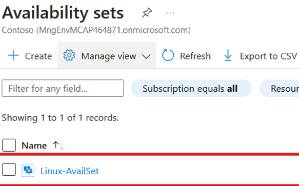
3. Check the Fault Domain and Update Domain assignments for the VM to ensure they are correctly distributed.
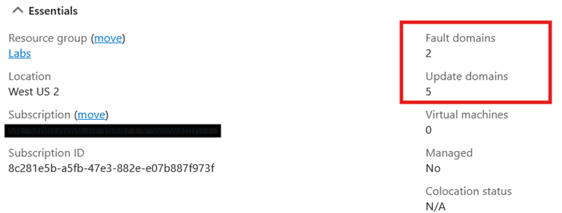
4. Capture a screenshot showing the fault domain and update domain information.

## Submission Guidelines

- Submit a screenshot of the deployed VM within the Availability Set, displaying the fault domain and update domain assignments.
- Include a brief explanation of how fault domains and update domains contribute to ensuring high availability in Azure.
- Upload the screenshot and description to the designated submission portal.

## Additional Resources

- [Azure Documentation: Availability Sets Overview](https://docs.microsoft.com/azure/virtual-machines/windows/tutorial-availability-sets)
- [Azure CLI Reference](https://learn.microsoft.com/en-us/cli/azure/vm/availability-set?view=azure-cli-latest)
