# Lab Title: Provisioning Azure DNS

## Lab Overview

This guided lab walks you through the process of provisioning and configuring Azure DNS to manage domain names and resolve them to Azure resources. By the end of this lab, you will gain hands-on experience in setting up DNS zones, creating DNS records, and testing domain name resolution.

## Pre-requisites

- An active Azure subscription.
- Basic knowledge of DNS concepts and record types (A, CNAME, MX, etc.).
- Familiarity with Azure Portal and resource creation in Azure.

## Learning Objectives

By the end of this lab, you will be able to:

- Understand the purpose and benefits of Azure DNS.
- Create a DNS Zone in Azure.
- Add and manage DNS records such as A, CNAME, and TXT records.
- Verify domain name resolution for Azure resources.

## Lab Description

This lab guides you through provisioning a DNS Zone in Azure, adding necessary DNS records, and verifying their proper functioning. You will also learn to associate DNS records with Azure resources.

## TASKS

### Task 1: Create a DNS Zone

**Objective:** Create a DNS Zone to manage custom domain names in Azure.

**Instructions:**

1. Navigate to the Azure Portal.
2. In the search bar, type **DNS Zone** and select 
**DNS zones** from the results.
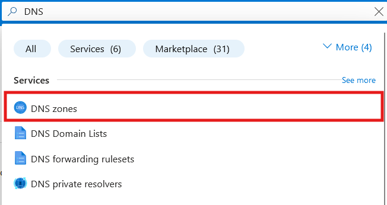
3. Click Create to start the DNS Zone creation process.
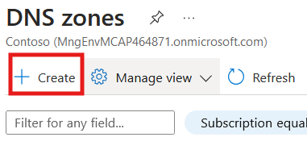

4. Configure the following settings:
    - **Subscription:** Select your subscription.
    - **Resource Group:** Create a new resource group or select an existing one.
    - **Name:** Enter the domain name you want to manage (e.g., example.com).
    - **Location:** Select a region (this does not affect the functionality).
    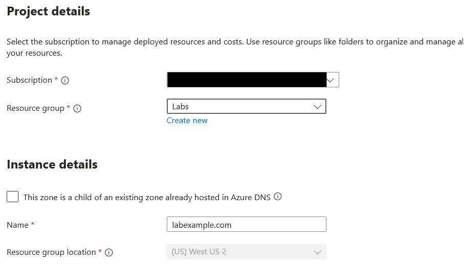
5. **Click Review + Create**, then **Create** after the validation process completes.
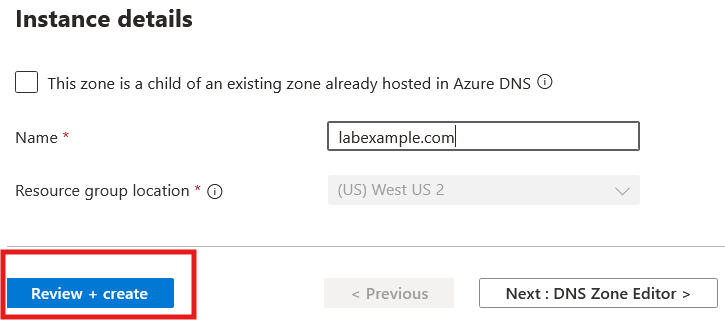
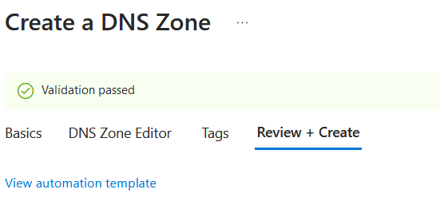
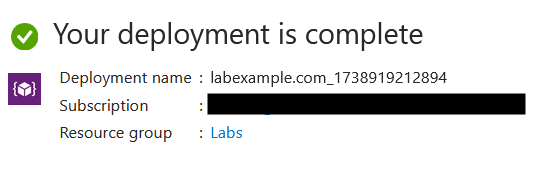
### Task 2: Add DNS Records

**Objective:** Add DNS records to map your domain name to specific resources.

**Instructions:**

1. Navigate to the DNS Zone you created in Task 1.
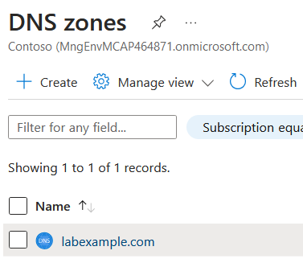
2. Click + **Record Set** to add a new DNS record.
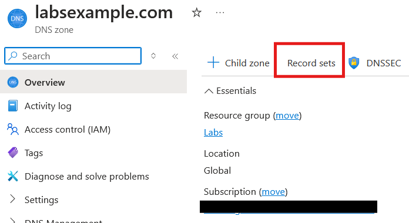
3. Configure the record as per your requirement:
    - **Example:** Create an A record:
        - **Name:** Leave it blank to map the record to the root domain (labexample.com).
        - **Type:** Select **A (IPv4 address)**.
        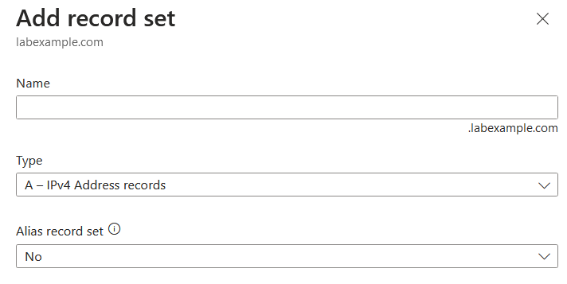
        - **TTL:** Set the Time to Live (e.g., 3600 seconds).
        - **IP Address:** Enter the public IP of an Azure resource or custom IP.
        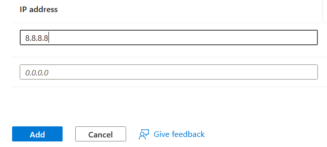
        - Click Add to save the record.
        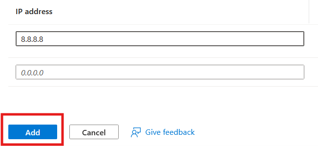
    - **Example:** Create a CNAME record:
        - **Name:** Enter a subdomain (e.g., www).
        - **Type:** Select **CNAME (Alias)**.
        - **TTL:** Set as required.
        - **Alias:** Enter the fully qualified domain name (FQDN) of the target resource.
        - Click **ADD** to save the record.

### Task 3: Test Domain Name Resolution

**Objective:** Verify that DNS records resolve correctly.

**Instructions:**

1. Open a terminal or command prompt on your local machine.
2. Use the nslookup command to verify the DNS resolution for your domain:

    ```sh
    nslookup example.com  
    nslookup www.example.com  
    ```
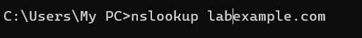
3. Confirm that the response contains the correct IP address for the A record and CNAME for the subdomain.
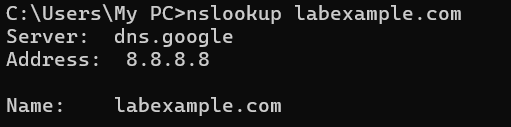
4. Document the results.

### Task 4: Cleanup (Optional)

**Objective:** Remove resources to avoid unnecessary charges.

**Instructions:**

1. Navigate to the **Resource Group** where the DNS Zone resides.
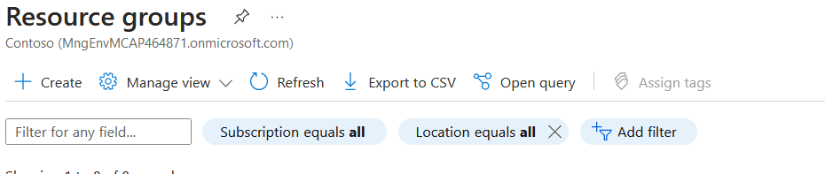
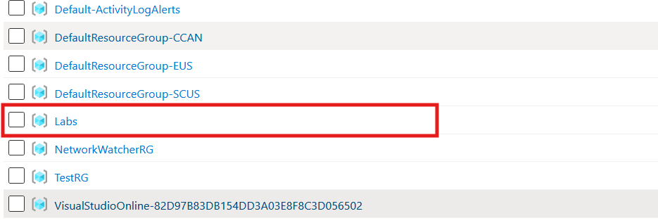
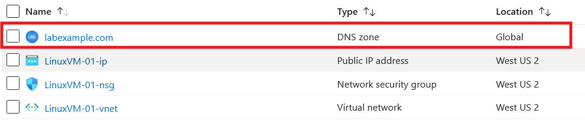
2. Select the DNS Zone and click **Delete**.
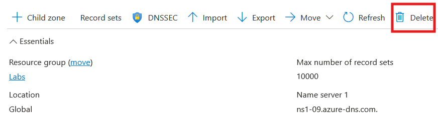
3. Confirm the deletion by entering the resource name as prompted.
4. Delete any other associated resources if required.

### Task 4: Cleanup (Optional)

**Objective:** Remove resources to avoid unnecessary charges.

**Instructions:**

1. Navigate to the **Resource Group** where the DNS Zone resides.
2. Select the DNS Zone and click **Delete**.
3. Confirm the deletion by entering the resource name as prompted.
4. Delete any other associated resources if required.

## Submission Guidelines

- Submit a screenshot showing the DNS records you created.
- Include a brief explanation of how the domain name resolution was verified.
- Upload the screenshot and description to the designated submission portal.

## Additional Resources

- [Azure DNS Documentation](https://learn.microsoft.com/en-us/azure/dns/)
- [DNS Record Types Explained](https://learn.microsoft.com/en-us/azure/dns/dns-overview)
