# Configuring Azure Private Link for Azure Storage

## Lab Overview
In this guided lab, you will learn how to configure Azure Private Link for securely connecting to Azure Storage over a private network. Azure Private Link enables secure, private access to Azure Storage services, ensuring that your data traffic never traverses the public internet. By the end of this lab, you will have hands-on experience in setting up a private endpoint, configuring DNS resolution, and monitoring connectivity.

## Pre-requisites
- An active Azure subscription with necessary permissions to create resources.
- Familiarity with Azure Virtual Networks and Azure Storage.
- Basic knowledge of Azure Private Link and DNS configurations.
- Access to the Azure Portal.

## Learning Objectives
By the end of this lab, you will be able to:
- Create a Virtual Network and Subnet for hosting the private endpoint.
- Create and configure a Private Endpoint for accessing Azure Storage securely.
- Set up DNS Resolution for Azure Storage over the private endpoint.
- Monitor the health and performance of the Private Link connection.
- Test connectivity from a Virtual Machine (VM) to Azure Storage using the private endpoint.

## Lab Description
This lab will guide you through the process of configuring Azure Private Link to securely connect to Azure Storage over a private IP. You will configure networking, DNS, and connectivity between a Virtual Machine and Azure Storage, ensuring that all traffic stays within the private network.

---

## TASKS

### Task 1: Create a Virtual Network and Subnet
**Objective**: Create a Virtual Network (VNet) and Subnet to host the private endpoint for Azure Storage.

**Instructions**:
1. **Open the Azure Portal**:
   - Navigate to the Azure Portal.
2. **Create a New Virtual Network**:
   - In the search bar, type "Virtual Networks" and select it.
   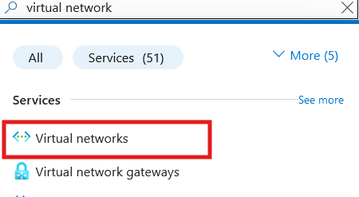
   - Click `+ Create` to begin creating a new VNet.
   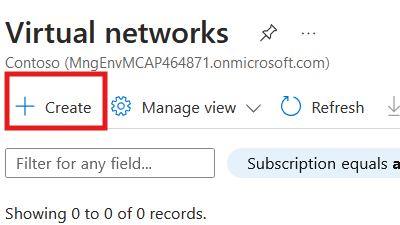
   - Enter the following details:
     - Name: `MyVNet`
     - Region: Select a region (e.g., East US).
     - Address Space: `10.0.0.0/16` (this will be the address range for the entire VNet).
     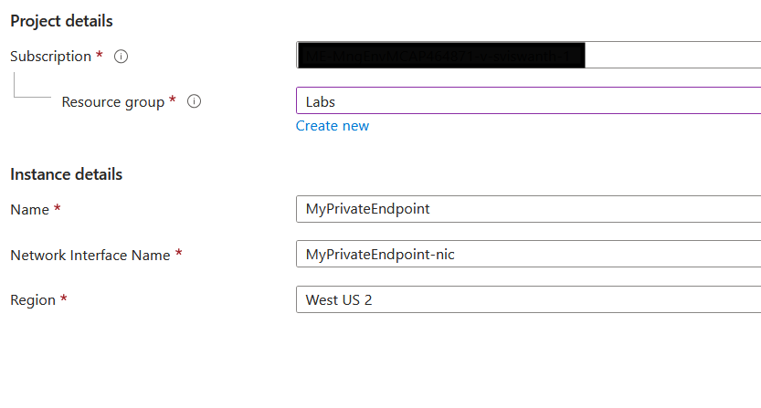
   - Click `Next: Security`, and leave the default security settings.
   - Click `Next: Tags` (if applicable), then `Review + Create`.
   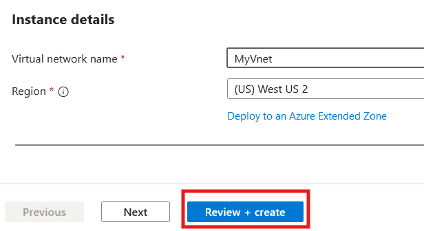
   - Review the configuration, then click `Create`.
   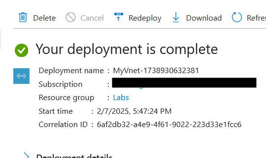
3. **Create a Subnet**:
   - After your VNet is created, navigate to Subnets under the Settings section.
   - Click `+ Subnet` to create a new subnet.
   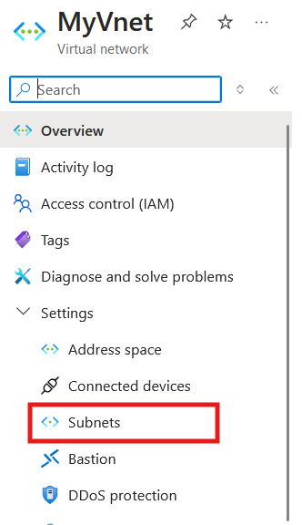
   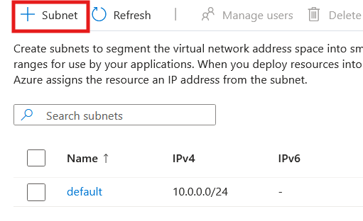
   - Enter the following details:
     - Name: `MySubnet`
     - Address Range: `10.0.1.0/24` (this subnet will host the private endpoint).
     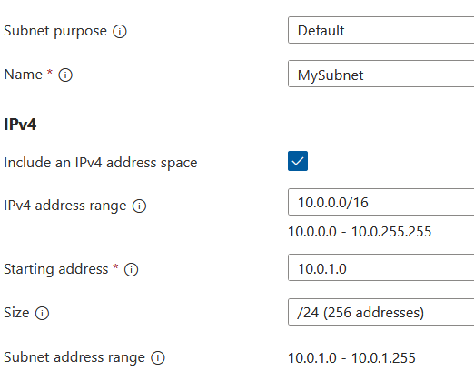
   - Click `Create`.

**Verification**:
- Ensure that `MyVNet` is successfully created.
- Confirm that `MySubnet` is listed under `MyVNet` in the Subnets section.

---

# Task 2: Create a Private Endpoint for Azure Storage with Disabled Public Access

**Objective**: Create a Private Endpoint to securely access Azure Storage over a private IP address and disable public access.

## Instructions:

### 1. Create Storage Account in the Same Virtual Network:
- Navigate to the Azure Portal and search for **"Storage Accounts"**.
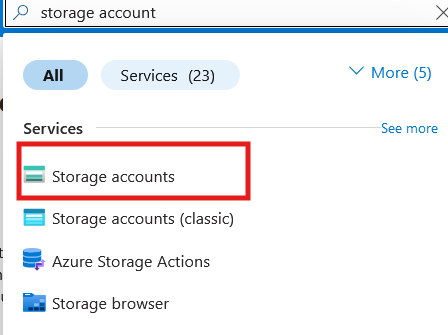
- Click `+ Create` to create a new storage account.
- Configure the storage account as follows:
  - **Subscription**: Choose the appropriate subscription.
  - **Resource Group**: Choose or create a new resource group.
  - **Storage account name**: Choose a unique name.
  - **Region**: Select the same region as your Virtual Network (e.g., East US,West US).
  - **Performance**: Choose the desired performance (Standard/Premium).
  - **Replication**: Select the preferred replication option.
  - **Networking**: Select "Private Endpoint" for network connectivity.
  - **Virtual Network**: Select `MyVNet`.
  - **Subnet**: Choose `MySubnet`.
  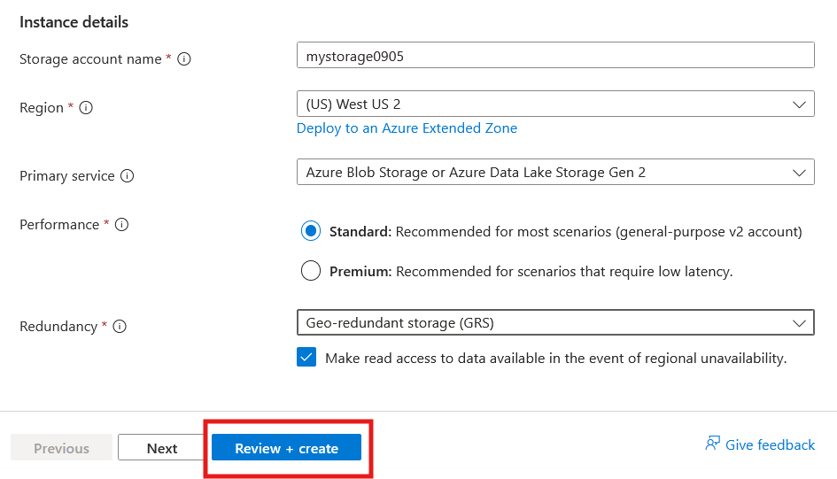
- Click `Review + Create`, verify the settings, and click `Create`.

### 2. Disable Public Access on the Storage Account:
- After the storage account is created, go to the storage account page.
- In the left-hand menu, under **Security + networking**, click on **Networking**.
- Under **Firewalls and virtual networks**, set **Public network access** to **Disabled**.
- Click `Save` to apply the changes.

### 3. Navigate to Private Endpoints:
- In the Azure Portal, search for **"Private Endpoints"** and select it.
- Click `+ Create` to create a new private endpoint.
  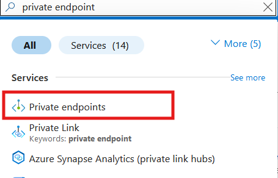

  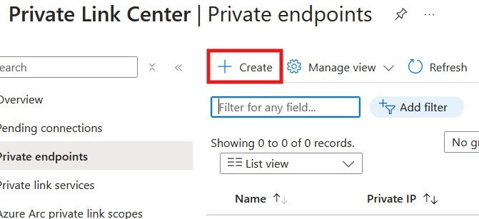

### 4. Configure Private Endpoint Settings:
- Select your **Subscription** and **Resource Group**.
- Name: `MyPrivateEndpoint`.
   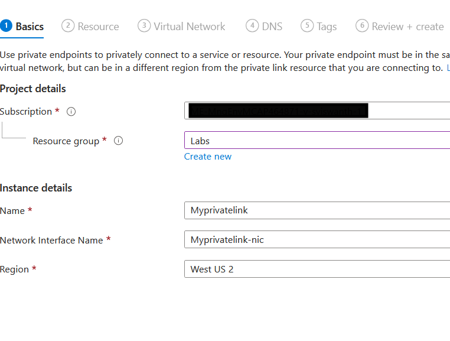
- Region: Choose the same region as the Virtual Network (e.g., East US).
- **Resource Type**: Select `Microsoft.Storage/storageAccounts`.
- **Resource**: Choose your Azure Storage Account (created in Step 1).
- **Target Sub-resource**: Choose `Blob` (or another service like File, depending on your use case).
   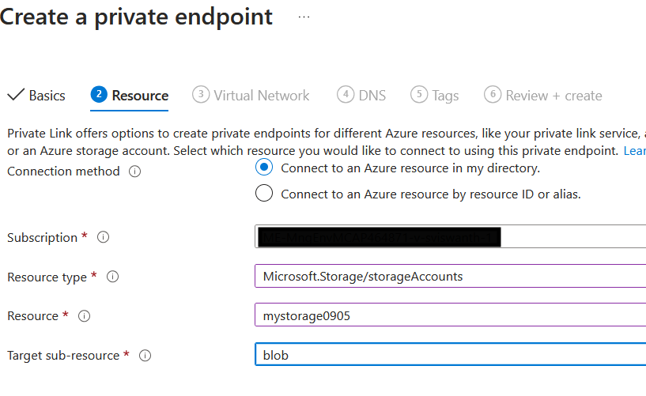
- **Virtual Network**: Select `MyVNet`.
- **Subnet**: Choose `MySubnet`.

### 5. Review and Create:
- Review your configuration and click `Create` to deploy the private endpoint.
   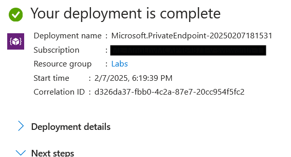

## Verification:
- After the deployment is complete, navigate to **Private Endpoints** and ensure that `MyPrivateEndpoint` is listed with your Azure Storage Account.
- Verify the status of the private endpoint as `Succeeded`.
- Verify that public access is disabled on the storage account under the **Networking** section.

---

### Task 3: Configure DNS for Azure Storage Private Link  
**Objective**: Ensure that DNS queries for Azure Storage are resolved via the private endpoint.

**Instructions**:

1. **Access the Private Link Center**:  
   - In the Azure Portal, use the search bar to search for **Private Link Center**.  
   - Click on **Private Link Center** in the results to open the Private Link dashboard.

2. **Select the Private Endpoint**:  
   - Under the **Private Endpoints** section, locate and select your Private Endpoint (e.g., `MyPrivateEndpoint`) that was created in Task 2.
    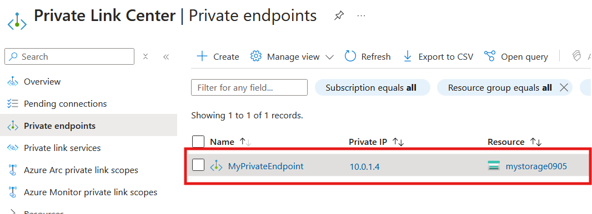

3. **Link the DNS Zone to Your Virtual Network**:  
   - If the DNS zone is not already linked, create a new Private DNS Zone and link it to your Virtual Network.  
     To create a new Private DNS Zone, follow these steps:
     1. Go to **Create a resource** in the Azure Portal.
     2. Search for and select **Private DNS Zone**.
      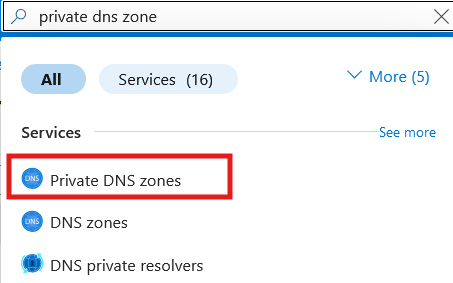
     3. Click **Create** and provide the necessary information:
        - **Name**: A unique name for the DNS zone, e.g., `privatelink.blob.core.windows.net`.
        - **Subscription**: Select the same subscription where your Virtual Network resides.
        - **Resource Group**: Choose the same resource group as the Virtual Network or create a new one.
        - **Region**: Select the region that matches your Virtual Network.
        

4. **Link the DNS Zone to Your Virtual Network**:  
   - Once your Private DNS Zone is created, go to the DNS zone's settings and find **Virtual Network Links**.  
      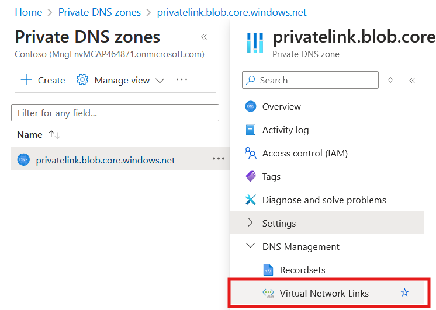
   - Click **+ Add** to create a new link between the DNS Zone and your `MyVNet` Virtual Network.  
   - Ensure that **Enable auto-registration of records** is checked so that new records (such as the private endpoint) are automatically registered in the DNS zone.

5. **Verify DNS Resolution**:  
   - After linking the Private DNS Zone to your Virtual Network, use the **DNS Resolution** tab in the **Private Link Center** to verify that DNS queries for Azure Storage resolve to the private IP address.  
   - Ensure that the private IP address of your `MyPrivateEndpoint` is returned when querying the domain name for Azure Storage (e.g., `mystorageaccount.blob.core.windows.net`).
 
---

### Task 4: Monitor Private Link Connection (Optional Task)
**Objective**: Monitor the health of the Private Link connection to Azure Storage.

**Instructions**:
1. **Monitor Connection State**:
   - In the Private Link Center, select your Private Endpoint (`MyPrivateEndpoint`).
   - Ensure that the Connection State is `Approved` and `Succeeded`.
   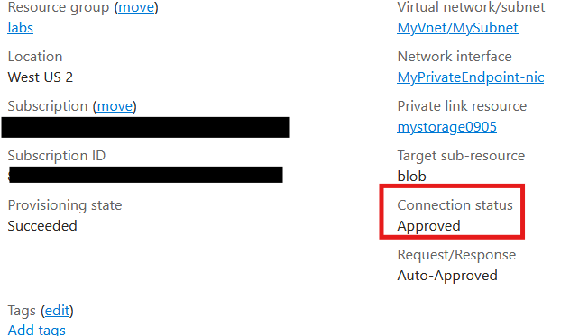
2. **Use Network Watcher for Connectivity**:
   - Navigate to `Network Watcher` in the Azure Portal.
      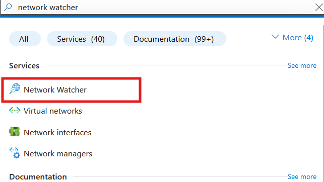
   - Under `Connection Monitor`, click `+ Add` to create a new monitor.
      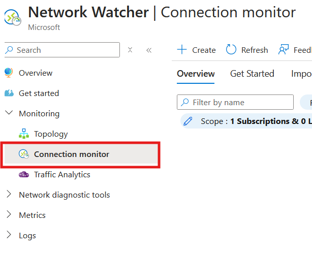
      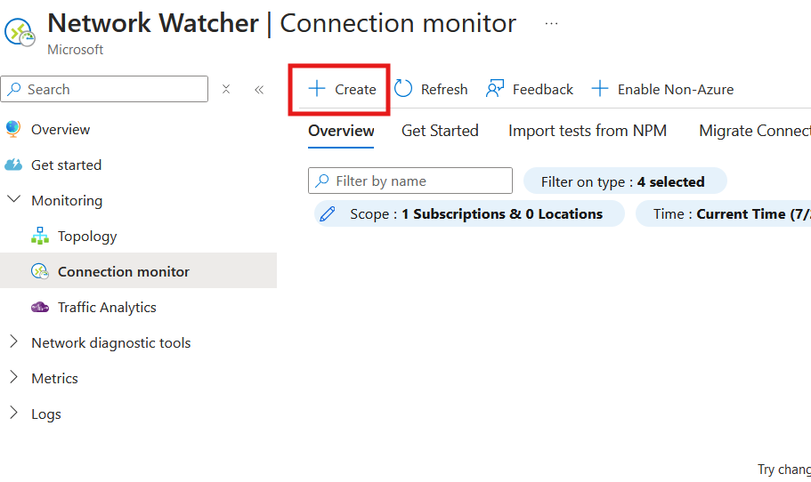
   - For Source, you can leave this field empty or skip it if you're only checking the general status of the private endpoint.
   - For Destination, select the private endpoint for Azure Storage.
   - Click `Start Monitoring` to ensure that the private endpoint is reachable and there are no connectivity issues.

**Verification**:
- Ensure that the Connection State in the Private Link Center is `Succeeded`.
- Monitor the Connection Monitor to ensure there are no connectivity issues reported for the private endpoint.

---

# Task 5: Test Connectivity to Azure Storage via Private Endpoint

## Objective:
Test connectivity from a Virtual Machine (VM) to Azure Storage using a private endpoint.

## Step 1: Create a Virtual Machine

1. Navigate to the **Azure Portal** and select **Virtual Machines**.
2. Click **+ Create** to create a new VM.
   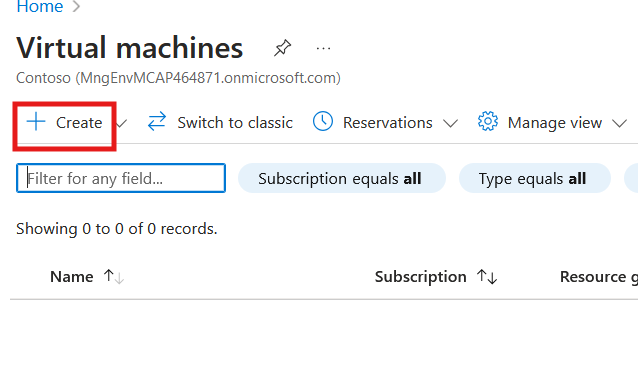
3. Configure the VM settings:
    - **Name:** MyVM
    - **Region:** Select the same region as your private endpoint (e.g., East US).
    - **Virtual Network:** Choose **MyVNet**.
    - **Subnet:** Choose **MySubnet**.
    - **Public IP Address:** Select **None** (ensures the VM has no public IP and uses the private endpoint).
    - **Operating System:** Choose your preferred OS (e.g., Windows or Linux).
4. Review and create the VM.

## Step 2: Connect to the VM

- Once the VM is deployed, connect to it using:
    - **RDP** (for Windows) or
    - **SSH** (for Linux), depending on your operating system.
   

## Step 3: Verify Access to Azure Storage via the Private Endpoint

### 1. List Containers in Your Storage Account:

To verify your access to the storage account, run the following command from your VM to list containers in your storage account:

```bash
az storage container list --account-name mystorage0905 --auth-mode login --output table
```

**Explanation:**
- **`az storage container list`:** Lists all containers within the specified storage account.
- **`--auth-mode login`:** Uses your Azure login credentials to authenticate the command.
- **`--output table`:** Formats the output into a readable table.

**What to Expect:**
- If no containers exist, the output will be empty.
- If containers exist, you will see their details in the table.

**What if the list is empty?**
- This could mean there are no containers created yet.
- If you encounter authentication errors like "AuthorizationFailed" or "Access Denied," check that your account has sufficient permissions to access the storage account.
   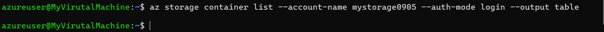

### 2. Troubleshoot Authentication or Access Issues:
- **No Containers:** Confirm that containers have been created in the storage account.
- **Authentication Issues:** If there is an authentication error:
    - Run `az login` to ensure you're logged in with the correct Azure account.
    - Check **Role-Based Access Control (RBAC)** to ensure your account has the **Storage Blob Data Reader** role or higher for the storage account.

## Step 4: Verify Private Endpoint Resolution

### 1. Check DNS Resolution for the Private Endpoint:

Run the following `nslookup` command to check if the storage account resolves to a private IP address:

```bash
nslookup mystorageaccount.blob.core.windows.net
```

**Explanation:**
- The **`nslookup`** command checks the DNS resolution for your storage account.
- When a private endpoint is configured, the DNS query should resolve to a private IP address (e.g., 10.x.x.x or 192.168.x.x) within your virtual network.

**Expected Results:**
- If the DNS resolution is correct, the response will show a private IP address:
    - Example output:

    ```text
    Server:  UnKnown
    Address:  10.0.0.4

    Non-authoritative answer:
    Name:    mystorage0905.privatelink.blob.core.windows.net
    Addresses:  10.0.1.4
    ```

- The **Canonical Name (CNAME)** should indicate that `mystorage0905.blob.core.windows.net` resolves to `mystorage0905.privatelink.blob.core.windows.net`, confirming that the connection is routed via the private endpoint.
- The **IP Address (10.0.1.4)** should be a private IP, verifying that the storage account is being accessed through the private endpoint.
   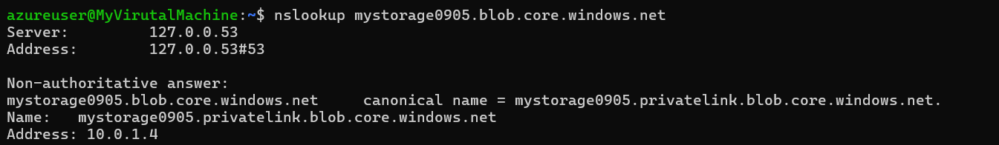

## Final Verification

By performing the steps above, you confirm that your VM has proper connectivity to Azure Storage through the private endpoint. This ensures secure, internal communication within your virtual network, preventing public internet exposure.

   - **Important**: Ensure that you are accessing Azure Storage using the private endpoint’s private IP. You can verify this by checking the connection logs or by using tools like Network Watcher to confirm that traffic is routed through the private IP.

**Verification**:
- Confirm that the VM is able to access the Azure Storage account via the private endpoint.
- Review Private Endpoint logs to verify that the connection is using the private IP address and not a public IP.
- You can also use the Network Watcher connection monitoring tool to ensure the VM can reach Azure Storage without routing traffic over the public internet.

---

## Clean-Up
**Objective**: Clean up all resources created during the lab.

**Instructions**:
1. **Delete the Virtual Machine**:
   - In the Azure Portal, navigate to `Virtual Machines`.
   - Select the VM you created and click `Delete`.
2. **Delete the Private Endpoint**:
   - Navigate to `Private Endpoints` in the Azure Portal.
   - Select `MyPrivateEndpoint` and click `Delete`.
3. **Delete the Virtual Network and Subnet**:
   - Navigate to `Virtual Networks` and select `MyVNet`.
   - Click `Delete` to remove the entire virtual network along with the subnet.
4. **Delete the Resource Group (optional)**:
   - If you want to remove all associated resources, navigate to `Resource Groups`.
   - Select your resource group and click `Delete`.

---

## Submission Guidelines
- Submit a screenshot of the Private Endpoint configuration showing the private endpoint setup and DNS integration.
- Include a brief explanation of how Azure Private Link enhances security and ensures private access to Azure Storage.
- Upload the screenshots and description to the designated submission portal.

---

## Additional Resources
- [Azure Private Link Overview](https://docs.microsoft.com/en-us/azure/private-link/private-link-overview)
- [Configuring DNS for Azure Private Link](https://docs.microsoft.com/en-us/azure/private-link/configure-dns)
- [Azure Storage Documentation](https://docs.microsoft.com/en-us/azure/storage/)
- [Azure Private Link Documentation](https://docs.microsoft.com/en-us/azure/private-link/)
- [Azure Virtual Network Documentation](https://docs.microsoft.com/en-us/azure/virtual-network/)
- [Private Endpoints and DNS Resolution](https://docs.microsoft.com/en-us/azure/private-link/private-endpoint-dns)