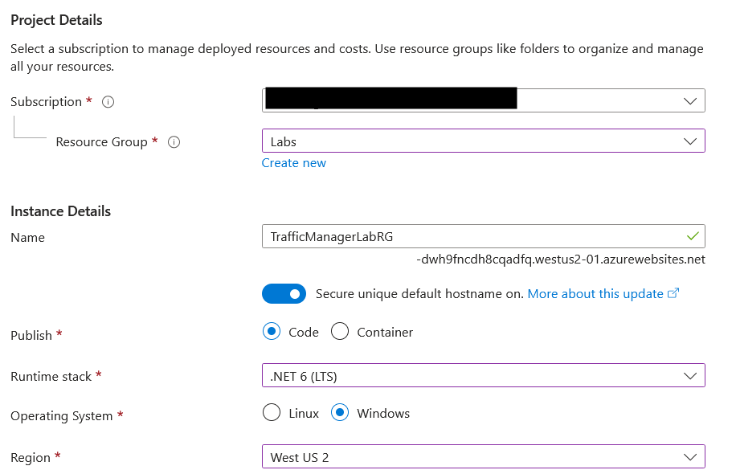

# Deploy and Configure Azure Traffic Manager

## Lab Overview

In this lab, you will learn how to create, configure, and test Azure Traffic Manager to manage traffic distribution across multiple endpoints. You will explore the different routing methods available and verify the functionality by simulating endpoint failures.

## Pre-requisites

- An active Azure subscription.
- Basic understanding of Azure resource creation.
- A web browser and internet connection.
- Familiarity with the Azure Portal.

## Outcomes

By the end of this lab, you will:

- Understand how Azure Traffic Manager works.
- Create Traffic Manager profiles.
- Configure routing methods for efficient traffic management.
- Test failover and traffic routing between endpoints.

## Description

Azure Traffic Manager enables you to control the distribution of user traffic for service endpoints in different Azure regions. With features like priority routing and geographic distribution, Traffic Manager ensures application performance and availability.

## TASKS

### Task 1: Create Web App Endpoints

#### Step 1: Log in to the Azure Portal

1. Open a web browser and navigate to Azure Portal.
2. Sign in with your Azure account credentials.

#### Step 2: Create the First Web App

1. In the left-hand menu, click **Create a resource**.
    
2. Search for **Web App** and select it from the search results.
    
3. Click **Create** to launch the web app creation wizard.
    
4. Configure the web app with the following details:
    - **Subscription:** Select your subscription.
    - **Resource Group:** Click **Create new**.
    - **Name:** Enter a globally unique name, e.g., TrafficManagerLabRG`.
    - **Publish:** Select **Code**.
    - **Runtime Stack:** Choose `.NET 6 (LTS)`.
    - **Operating System:** Select **Windows**.
    - **Region:** Select **West US**.
        
5. Click **Next: Monitoring** and disable Application Insights.
    
6. Click **Review + Create**, and then click **Create** to deploy the web app.
    
#### Step 3: Create the Second Web App

1. Repeat the steps from Step 2, but configure the following changes:
    - **Resource Group:** .
    - **Name:** Enter a unique name, e.g., `TrafficManagerLabRG2`.
    - **Region:** Select **canada central**.
2. Click **Review + Create**, and then click **Create**.
    

#### Step 4: Verify Web App Deployments

1. Navigate to **Resource Groups > TrafficManagerLabRG (or) labs**.
2. Ensure both `TrafficManagerLabRG` and `TrafficManagerLabRG2` are listed.
    
3. Click on each web app and verify they are in the **Running** state.
    

**Verification:** Ensure both web apps are deployed and running by checking their status in the Azure Portal.

### Task 2: Create an Azure Traffic Manager Profile

#### Step 1: Navigate to Traffic Manager Profiles

1. In the Azure Portal, search for **Traffic Manager Profiles** in the top search bar.
2. Select **Traffic Manager Profiles** from the search results.
    
    

#### Step 2: Create a Traffic Manager Profile

1. Click **Create**.
    
2. Configure the profile as follows:
    - **Subscription:** Select your subscription.
    - **Resource Group:** Select `TrafficManagerLabRG or labs`.
    - **Name:** Provide a unique name, e.g., `TrafficManagerLabProfile`.
    - **Routing Method:** Select **Priority**.
    - **Resource Location:** Select **Global**.
        
3. Click **Review + Create**, then click **Create** to deploy the Traffic Manager profile.

**Verification:** After creation, verify that the Traffic Manager profile is listed under Traffic Manager Profiles in the portal.
    

### Task 3: Add Endpoints to the Traffic Manager Profile

#### Step 1: Open the Traffic Manager Profile

1. Navigate to the newly created `TrafficManagerLabProfile`.
2. Under Settings, select **Endpoints**.
    

#### Step 2: Add the First Endpoint

1. Click **Add**.
    
2. Configure the endpoint with the following details:
    - **Type:** Select **Azure Endpoint**.
    - **Name:** `WebAppEndpint1`
    - **Target Resource Type:** Select **App Service**.
    - **Target Resource:** Select `TrafficManagerLabRG`.
    - **Priority:** Set to `1`.
    
3. Click **OK**.

#### Step 3: Add the Second Endpoint

1. Click **Add** again.
2. Configure the endpoint with the following details:
    - **Type:** Select **Azure Endpoint**.
    - **Name:** `WebAppEndpint2`
    - **Target Resource Type:** Select **App Service**.
    - **Target Resource:** Select `TrafficManagerLabRG2`.
    - **Priority:** Set to `2`.
        
3. Click **OK**.

**Verification:** Confirm that both endpoints are successfully added under Endpoints in the Traffic Manager profile.

### Task 4: Test Traffic Routing

#### Step 1: Access the Traffic Manager DNS

1. In the Traffic Manager profile overview, copy the DNS Name.
    
2. Open a web browser and paste the DNS name.
3. Verify that the web app hosted in `TrafficManagerLabRG` is displayed.
    

#### Step 2: Simulate Endpoint Failure

1. Navigate to `TrafficManagerLabRG` in the Azure Portal.
2. Click **Stop** to stop the web app.
    
3. Wait for a few minutes (up to 5 minutes).
4. Refresh the DNS URL in your browser.
5. Verify that traffic is now routed to `TrafficManagerLabRG2`.
    

#### Step 3: Restart the First Web App

1. Navigate back to `TrafficManagerLabRG`.
2. Click **Start** to restart the web app.

**Verification:** Ensure that after the DNS propagation period, traffic switches back to `TrafficManagerLabRG` once it is restarted.

### Task 5: Change Routing Method

#### Step 1: Modify Routing Method

1. Navigate to the Traffic Manager profile.
2. Under Configuration, change the Routing Method to **Performance**.
3. Click **Save**.
    

#### Step 2: Test the New Routing Method

1. Access the Traffic Manager DNS URL.
2. Verify that traffic is routed to the endpoint with the best performance based on your location.

**Verification:** Confirm that traffic is routed according to the performance-based method.

## Submission Guidelines

- Submit the following evidence to validate your lab completion:
    - Screenshots of both web apps running.
    - Screenshot of the Traffic Manager profile with endpoints configured.
    - Screenshot showing traffic routed to `TrafficManagerLabRG2` after stopping `TrafficManagerLabRG`.
    - A short summary describing your observations on traffic routing.

## Additional Resources

- [Azure Traffic Manager Documentation](https://docs.microsoft.com/en-us/azure/traffic-manager/)
- [Create a Web App in Azure](https://docs.microsoft.com/en-us/azure/app-service/quickstart-create-dotnetcore-web-app)
- [Routing Methods in Traffic Manager](https://docs.microsoft.com/en-us/azure/traffic-manager/traffic-manager-routing-methods)
