# Hybrid File Synchronization using Azure Files and File Sync

## Lab Overview

In this guided lab, you will learn how to provision an Azure File Share and configure Azure File Sync to synchronize data between on-premises and cloud environments. This setup provides a scalable and secure way to manage file storage while enabling hybrid file access.

## Pre-requisites

- Basic knowledge of Azure portal and resource management
- Active Azure subscription
- Installed Azure PowerShell module
- On-premises Windows Server (2016 or later) environment or instructions to provision one

## Learning Objectives

By the end of this lab, you will:

- Create and configure Azure File Share
- Deploy Azure File Sync service
- Spin up and configure a Windows Server as a file sync agent
- Register an on-premises server for sync
- Create and configure sync groups
- Verify data synchronization between local and cloud environments

## Description

In this lab, you will gain practical experience in configuring file storage using Azure Files and Azure File Sync. These services allow organizations to efficiently store and sync files between their on-premises servers and Azure cloud, ensuring data availability and redundancy.

## TASKS

### Task 1: Create an Azure File Share
#### Objective
Provision an Azure File Share to store files in the cloud.

#### Instructions
1. Open the Azure Portal by navigating to [https://portal.azure.com](https://portal.azure.com).
2. Navigate to **Storage Accounts** and click **+ Create**.
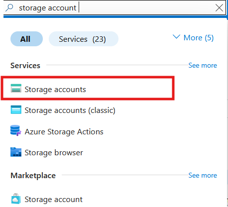
3. Select your subscription and resource group.
4. Provide the following details:
   - **Storage Account Name:** Enter a unique name, e.g., `labfilestorage<unique-id>`.
   - **Region:** Select a region closest to your location.
   - **Performance:** Select **Standard**.
   - **Replication:** Choose **Locally-Redundant Storage (LRS)**.
   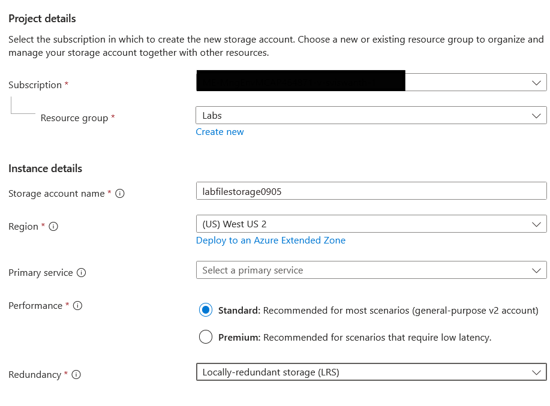
5. Click **Review + Create**, then click **Create** after validation completes.
6. Once the deployment completes, navigate to the storage account.
7. Go to **File Shares** under the **Data Storage** section and click **+ File Share**.
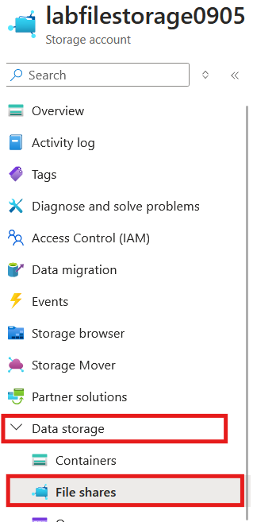
8. Enter a name for the file share, e.g., `labfileshare`, and set the quota to `5 GB`.
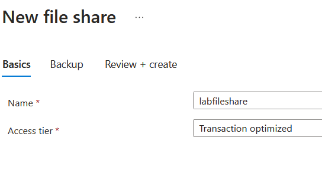
9. Click **Create**.

#### Verification
- Navigate back to the storage account and ensure that the file share appears in the list.

---

### Task 2: Deploy Azure File Sync
#### Objective
Set up Azure File Sync to enable synchronization between the Azure File Share and an on-premises server.

#### Instructions
1. In the Azure Portal, search for **Azure File Sync** and click **+ Create**.
2. Select your subscription and resource group.
3. Provide the following details:
   - **Name:** Enter `labfilesync`.
   - **Region:** Select the same region as your storage account.
   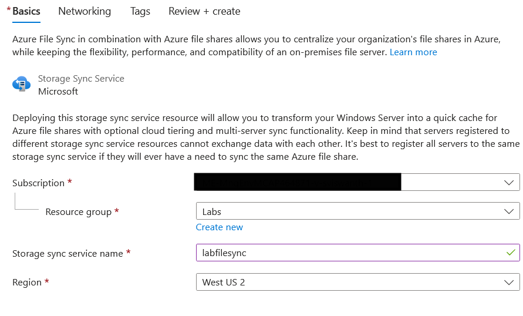
4. Click **Review + Create**, then click **Create** after validation completes.
5. Once deployment completes, navigate to the Azure File Sync resource.
6. Click **+ Sync Group**.
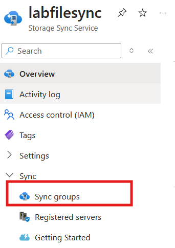
   - Name the sync group: `labfilesyncgroup`
   - Select the storage account and file share created earlier.
   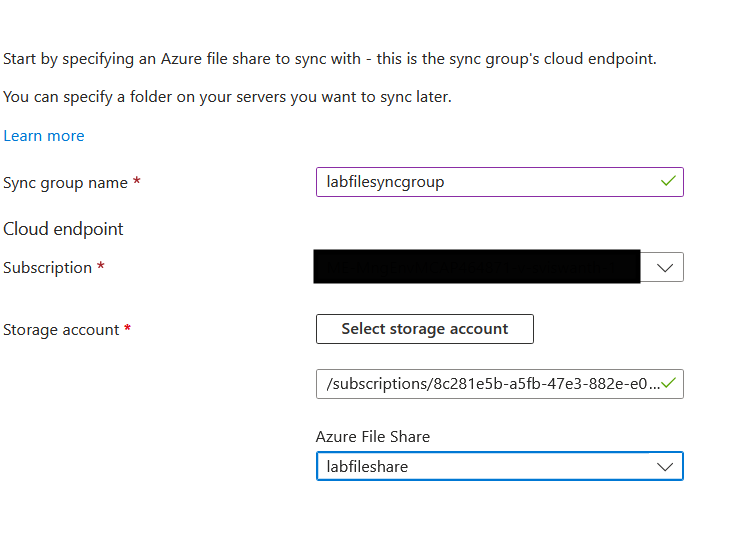
   
7. Click **Create**.

#### Verification
- Ensure the sync group appears under the Azure File Sync resource.

---

### Task 3: Spin Up and Register a Windows Server
#### Objective
Create and configure a Windows Server to act as an on-premises file sync agent.

#### Instructions
#### Step 1: Create a Windows Server Virtual Machine
1. In the Azure Portal, navigate to **Virtual Machines** and click **+ Create**.
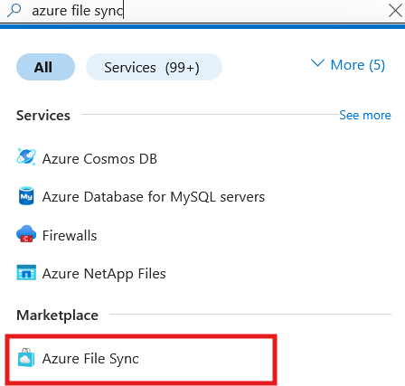
2. Select **Azure Virtual Machine**.
3. Provide the following details:
   - **Subscription:** Select your subscription.
   - **Resource Group:** Choose or create a resource group.
   - **Virtual Machine Name:** Enter `labfileserver`.
   - **Region:** Select the same region as your storage account.
   - **Image:** Choose **Windows Server 2019 Datacenter** (or a later version).
   - **Size:** Select a size such as **Standard D2s v3**.
   - **Administrator Account:** Provide a username and password.
   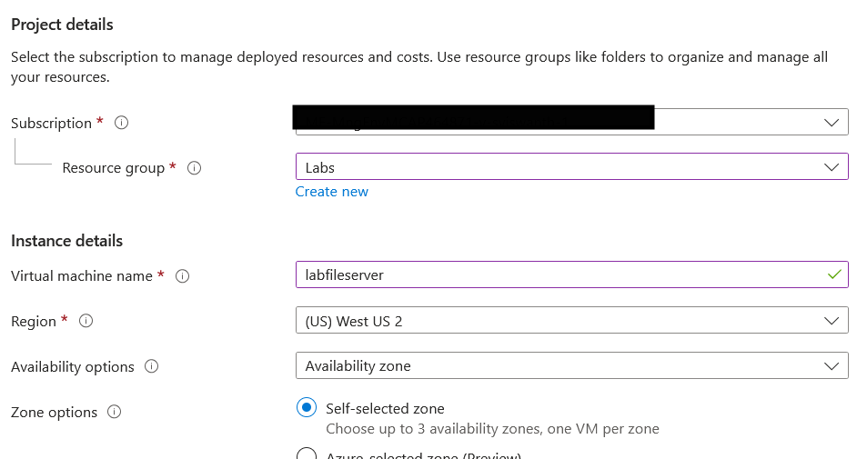
   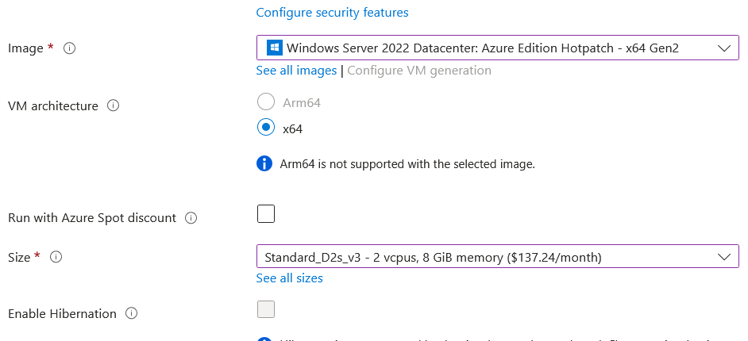

5. Click **Review + Create** and then **Create**.

#### Step 2: Connect to the Windows Server VM
1. Once the deployment completes, navigate to the VM resource.
2. Click **Connect** > **RDP** and download the RDP file.
3. Open the RDP file and connect to the server using the credentials you provided during setup.
4. Ensure the server is fully updated via **Windows Update**
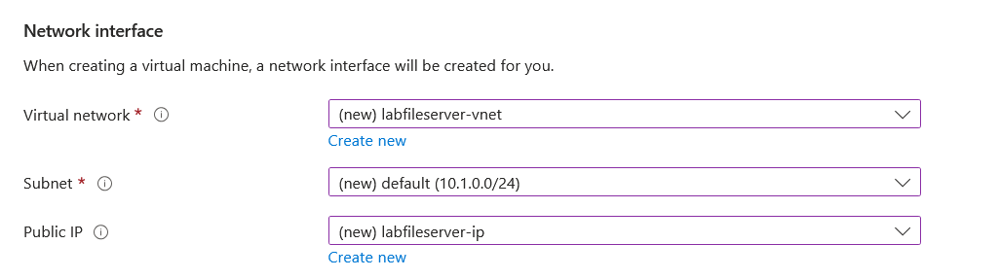
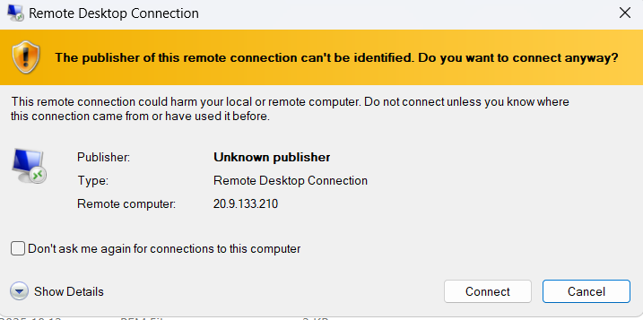

#### Step 3: Install Azure File Sync Agent
1. Open a browser on the Windows Server and navigate to [Azure File Sync Agent Download](https://aka.ms/AFSAgent).
2. Download and install the agent by following the prompts.
3. After installation, launch the **Azure File Sync Agent** wizard.
4. Click **Sign In** and authenticate with your Azure credentials.
5. Select your subscription and resource group.
6. Choose the Azure File Sync resource you created earlier and click **Register**.
7. Restart the server if prompted.

#### Verification
- In the Azure portal, navigate to the Azure File Sync resource and confirm that your server appears under **Registered Servers**.
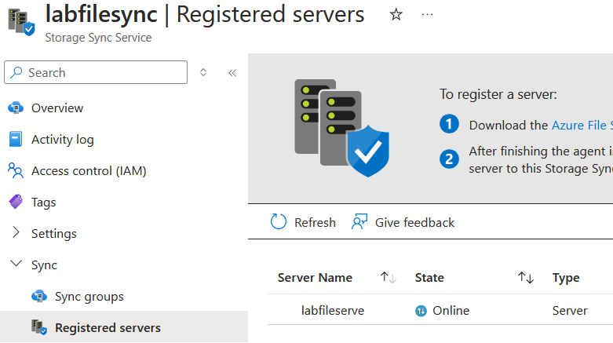

---

### Task 4: Configure Sync Group and Synchronize Data
#### Objective
Synchronize a local folder on the Windows Server with the Azure File Share.

#### Instructions
#### Step 1: Prepare the Local Folder
1. On the Windows Server, create a folder at `C:\LabSyncFolder`.
2. Place a test file, e.g., `testfile.txt`, in the folder.

#### Step 2: Add Server Endpoint to Sync Group
1. In the Azure Portal, navigate to the Azure File Sync resource.
2. Select your sync group and click **+ Add Server Endpoint**.
    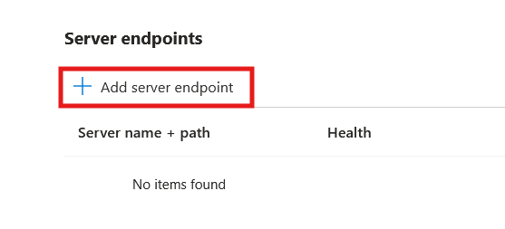
3. Choose the registered server from the dropdown.
4. Specify the path as `C:\LabSyncFolder`.
5. Enable **Cloud Tiering** if desired and set the policy (default settings are recommended).
6. Click **Create**.

#### Step 3: Verify Data Synchronization
1. On the Windows Server, create a new file in `C:\LabSyncFolder`, e.g., `syncverify.txt`.
2. Navigate to the Azure Portal and check the Azure File Share for the presence of the newly created file.
3. Similarly, upload a file directly to the Azure File Share and confirm that it appears in the local folder on the Windows Server.

#### Verification
- Confirm that files are synchronized in both directions between the local folder and Azure File Share.
- Ensure no errors are displayed in the Azure File Sync resource.

---

## Submission Guidelines
- Provide screenshots of the following:
  - Azure File Share creation
  - Sync group configuration
  - Server registration confirmation
  - Successful sync verification (file in Azure File Share and local folder)

## Additional Resources
- [Azure Files Documentation](https://learn.microsoft.com/en-us/azure/storage/files/)
- [Azure File Sync Documentation](https://learn.microsoft.com/en-us/azure/storage/files/storage-sync-files-overview)