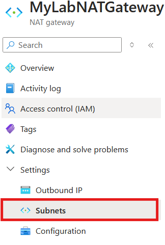
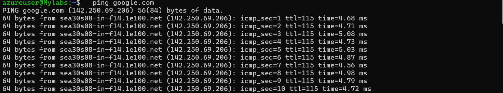
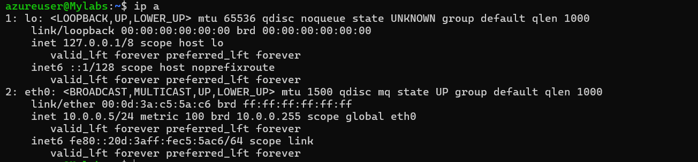

# Lab Title: Configuring and Testing Azure NAT Gateway

## Lab Overview

This lab provides a comprehensive guide on configuring and testing an Azure NAT Gateway for enabling outbound internet connectivity for a virtual machine (VM) within a virtual network (VNet). You will learn how to create a VNet and subnet, configure a NAT Gateway, associate it with a subnet, deploy a VM, and verify the VM's internet connectivity.

## Pre-requisites

- An active Azure subscription.
- Basic understanding of Azure networking concepts.
- Familiarity with Azure Portal and Azure CLI.
- A resource group in Azure for the lab setup.

## Outcomes

Upon completing this lab, participants will:

- Understand the concept and functionality of Azure NAT Gateway.
- Be able to create and configure a NAT Gateway and associate it with a subnet.
- Deploy and configure a virtual machine within a subnet connected to the NAT Gateway.
- Verify and test outbound internet connectivity from the VM through the NAT Gateway.

## Description

Azure NAT Gateway enables outbound internet connectivity for resources in a virtual network (VNet) while maintaining the use of private IP addresses. It simplifies outbound traffic routing without the need for a public IP on each resource. In this lab, you will walk through the end-to-end process of setting up and testing NAT Gateway functionality.

## TASKS

### Task 1: Create a Virtual Network (VNet) and Subnet

**Objective:** To create a VNet and a subnet for associating the NAT Gateway.

**Instructions:**

1. **Sign in to the Azure Portal:**
    - Go to Azure Portal.
    - Sign in with your Azure credentials.

2. **Create a Resource Group:**
    - In the Azure Portal, search for Resource Groups in the search bar.
    - Click on **+ Create** to create a new resource group.
    - Fill in the following details:
        - **Subscription:** Choose your active subscription.
        - **Resource Group Name:** Enter a name (e.g., `MyLabResourceGroup`).
        - **Region:** Choose a region (e.g., East US).
    - Click **Review + Create** and then **Create**.

3. **Create the Virtual Network (VNet):**
    - After the resource group is created, search for Virtual Networks in the search bar.
    - Click **+ Create**.
    - Fill in the following details:
        - **Subscription:** Choose your active subscription.
        - **Resource Group:** Select the resource group you just created (e.g., `MyLabResourceGroup`).
        - **Region:** Choose the same region as the resource group.
        - **Name:** Enter a name for your VNet (e.g., `MyLabVNet`).
        - **Address Space:** Enter an address space (e.g., `10.0.0.0/16`).
    - Click **Next: Security > Next: Tags > Review + Create** and then **Create**.

4. **Create a Subnet:**
    - Once the VNet is deployed, go to **Subnets** under your VNet.
    - Click on **+ Subnet** to create a new subnet.
    - Fill in the following details:
        - **Name:** Enter a name for your subnet (e.g., `MyLabSubnet`).
        - **Subnet address range:** Enter an address range (e.g., `10.0.0.0/24`).
        - **Route Table:** Leave it as None for now (we will create and associate it in the next steps).
    - Click **Add** to create the subnet.

**Outcome:**

By the end of this task, you will have created a resource group, a VNet, and a subnet that will house the virtual machine (VM) connected to the NAT Gateway.

**Verification:**

- Ensure the subnet is created successfully within the VNet and has proper routing for internet access.

### Task 2: Create and Configure the NAT Gateway

**Objective:** To create and configure the NAT Gateway with the appropriate public IP.

**Instructions:**

1. **Create a NAT Gateway:**
    - In the Azure Portal, search for NAT Gateway in the search bar.
    
    - Click on **+ Create** to create a new NAT Gateway.
        
    - Fill in the following details:
        - **Subscription:** Choose your active subscription.
        - **Resource Group:** Select the same resource group you used earlier (e.g., `MyLabResourceGroup`).
        - **Region:** Choose the same region as your VNet (e.g., East US).
        - **Name:** Enter a name for the NAT Gateway (e.g., `MyLabNATGateway`).
        

2. **Configure Public IP Address:**
    - In the Public IP address section, select **Create new**.
    - Enter a name for the public IP address (e.g., `MyLabPublicIP`).
    - Ensure **IP Version** is set to IPv4.
    - Select **Static** as the IP address assignment.
    - Click **OK** to create the public IP.
        

3. **Create the NAT Gateway:**
    - After configuring the public IP, click **Review + Create**, review the settings, and then click **Create** to deploy the NAT Gateway.

**Outcome:**

At the end of this task, you will have created the NAT Gateway, configured it with a public IP, and associated it with the subnet to enable outbound internet connectivity for resources in the subnet.

**Verification:**

- Ensure the NAT Gateway is created and the public IP is correctly associated.

### Task 3: Associate NAT Gateway with Subnet

**Objective:** To associate the NAT Gateway with the subnet.

**Instructions:**

1. **Navigate to the NAT Gateway:**
    - Once the NAT Gateway is created, go to **All resources** in the Azure Portal.
        
    - Select the NAT Gateway you just created (e.g., `MyLabNATGateway`).

2. **Associate the NAT Gateway with the Subnet:**
    - In the NAT Gateway's **Settings**, select **Subnets**.
        
    - Click **+ Associate** to associate the NAT Gateway with a subnet.
    - In the **Associate Subnet** pane, select:
        - **Virtual Network:** Choose the VNet you created (e.g., `MyLabVNet`).
        - **Subnet:** Choose the subnet you created earlier (e.g., `MyLabSubnet`).
            
    - Click **Save** to complete the association.

3. **Verify Route Table:**
    - Navigate to **Route Tables** in the Azure Portal.
        
    - If there is no route table associated with the subnet, create one:
        - Click **+ Create** to create a new route table.   
            
        - Name it (e.g., `MyLabRouteTable`), choose the same region as your VNet, and create it.
            
    - After creating the route table, go to **Routes** and add a new route: 
        
        - **Address Prefix:** `0.0.0.0/0`
        - **Next hop type:** Internet
    - Associate this route table with your subnet.
        

**Outcome:**

By completing this task, you will have established the proper routing rules for outbound traffic, ensuring the NAT Gateway will manage all outbound internet traffic from the VM.
    
    
**Verification:**

- Check the association between the subnet and the NAT Gateway in the portal.
    

### Task 4: Deploy a Virtual Machine (VM)

**Objective:** To deploy a VM inside the subnet connected to the NAT Gateway.

**Instructions:**

1. **Create a Virtual Machine:**
    - In the Azure Portal, search for Virtual Machines.
    - Click **+ Create** to create a new VM.
    - Fill in the following details:
        - **Subscription:** Choose the same subscription as your NAT Gateway.
        - **Resource Group:** Choose the same resource group (e.g., `MyLabResourceGroup`).
        - **Region:** Choose the same region as your VNet and NAT Gateway (e.g., East US).
        - **Name:** Enter a name for the VM (e.g., `MyLabVM`).
        - **Size:** Choose a small VM size (e.g., `Standard_B1s`).
        - **Authentication type:** Choose Password and provide a username and password for login.

2. **Networking Configuration:**
    - Under **Networking**, select the VNet (`MyLabVNet`) and the subnet (`MyLabSubnet`).
    - Ensure that the Public IP is set to **None** (because we are using the NAT Gateway for outbound connectivity).
    - Click **Review + Create** and then **Create** to deploy the VM.

**Outcome:**

Upon completing this task, the VM will be set up in the subnet, and the stage is set for testing outbound connectivity through the NAT Gateway.

**Verification:**

- Ensure the VM is deployed in the correct subnet without a public IP.
    
### Task 5: Test Outbound Connectivity

**Objective:** To test outbound internet connectivity from the VM through the NAT Gateway.

**Instructions:**

1. **Connect to the VM:**
    - Once the VM is deployed, navigate to **Virtual Machines** in the Azure Portal.
    - Select your VM (e.g., `MyLabVM`).
    - Click **Connect** and choose SSH (for Linux) or RDP (for Windows).
        - For Linux, you can SSH using the command:
          ```sh
          ssh username@<VM-IP-Address>
          ```
        - For Windows, use Remote Desktop Protocol to connect to the VM.

2. **Test Internet Connectivity:**
    - Once logged in to the VM, test the internet connection:
        - For Linux: Run the following commands:
          ```sh
          ping google.com
          ```
          Or:
          ```sh
          curl http://example.com
          ```
                - For Windows: Open a web browser and try visiting any website (e.g., `http://example.com`).
        

3. **Confirm Connectivity:**
    - Verify that the VM can access the internet through the NAT Gateway (not directly using a public IP).
        

**Outcome:**

After this task, you will have verified that the VM is able to access the internet through the NAT Gateway, confirming that outbound traffic is routed correctly.

**Verification:**

- Confirm that the VM can successfully access external websites, indicating correct outbound routing via the NAT Gateway.

## Submission Guidelines

- Capture screenshots for the following:
    1. Creation of the VNet and Subnet.
    2. NAT Gateway configuration and public IP association.
    3. Subnet association with the NAT Gateway.
    4. VM creation and networking setup.
    5. Outbound connectivity test results from the VM.
    6. NAT Gateway monitoring metrics.
- Submit a single document that includes screenshots with brief explanations for each task.

## Additional Resources

- [Azure NAT Gateway Documentation](https://docs.microsoft.com/en-us/azure/virtual-network/nat-gateway/)
- [Azure Virtual Network Documentation](https://docs.microsoft.com/en-us/azure/virtual-network/)
- [Azure Virtual Machine Documentation](https://docs.microsoft.com/en-us/azure/virtual-machines/)
- [Network Watcher Overview](https://docs.microsoft.com/en-us/azure/network-watcher/)
