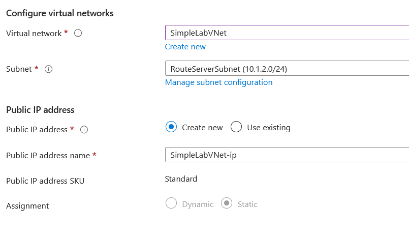

# Lab Title: Azure Route Server and BGP Configuration Lab

## Lab Overview

In this lab, you will create and configure an Azure Route Server for dynamic routing between Azure Virtual Machines (VMs) in a Virtual Network (VNet). You'll verify basic connectivity and then establish BGP peering between Azure Route Server and the VMs, which will allow dynamic route propagation.

## Prerequisites

- An active Azure subscription.
- Basic knowledge of Azure networking concepts (Virtual Networks, Subnets).
- Basic knowledge of SSH and BGP.

## Learning Objectives

By the end of this lab, you will be able to:

- Create a Resource Group and Virtual Network in Azure.
- Deploy and configure an Azure Route Server for dynamic routing.
- Deploy Azure VMs and test connectivity before and after configuring BGP routing.
- Understand the concept of BGP and how it works in Azure Route Server.
- Verify dynamic routing propagation and troubleshoot using various network tools.

## Lab Description

In this lab, you will set up an environment in Azure with:

- A Resource Group.
- A Virtual Network (VNet) with multiple subnets.
- Azure Route Server configured with BGP.
- Two Virtual Machines (VMs) to simulate network traffic.

You will then establish BGP peering between the Route Server and the VMs for dynamic route exchange and verify that the VMs can communicate after BGP routing is configured.

## Tasks

### Task 1: Create a Resource Group

**Objective:** To create a container for all the resources in this lab.

**Instructions:**

1. Navigate to the Azure Portal.
2. Create a new Resource Group with the name `SimpleRouteServerLab`.
3. Choose a region (e.g., East US).
4. Click **Review + Create**, then click **Create**.

**Verification:**

- Ensure that the Resource Group `SimpleRouteServerLab` is created and visible under Resource Groups in the portal.

### Task 2: Create a Virtual Network (VNet)

**Objective:** To create a network in which your VMs and Route Server will operate.

**Instructions:**

1. Navigate to Virtual Networks in the Azure portal.
2. Click **+ Create** to create a new VNet with the following settings:
    - **Name:** `SimpleLabVNet`
    - **Region:** Same as your Resource Group (East US).
    - **Address Space:** `10.1.0.0/16` (Defines the range for your network).
3. Create two subnets:
    - **TestSubnet:** Address Range `10.1.1.0/24`
    - **RouteServerSubnet:** Address Range `10.1.2.0/24` (for the Azure Route Server).
4. Click **Review + Create**, then **Create** to provision the Virtual Network.

**Verification:**

- Check that the Virtual Network `SimpleLabVNet` is created and has the specified subnets.

### Task 3: Deploy Azure Route Server

**Objective:** To deploy the Azure Route Server and enable dynamic routing.

**Instructions:**

1. In the Azure portal, search for Azure Route Server and select it.
    
2. Click **+ Create** and configure the Route Server:
    
    - **Name:** `SimpleRouteServer`
    - **Region:** Same as your Resource Group and VNet.
    - **Virtual Network:** Select `SimpleLabVNet`.
    
    - **Subnet:** Select `RouteServerSubnet`.
    
3. Click **Review + Create**, then click **Create** to deploy the Route Server.

**Verification:**

- Check that the `SimpleRouteServer` is deployed and visible under Route Servers in the Azure portal.
    

### Task 4: Deploy Two Test Virtual Machines (VMs)

**Objective:** To simulate communication between two VMs in the same VNet.

**Instructions:**

1. Navigate to Virtual Machines and create the first VM (`TestVM1`) with the following details:
    - **VM Name:** `TestVM1`
    - **Region:** Same as your Resource Group and VNet.
    - **Image:** `Ubuntu 24.04 LTS`.
    - **Size:** `Standard B1s`.
    - **Authentication Type:** SSH Key or Password.
    - **Virtual Network:** Select `SimpleLabVNet`.
    - **Subnet:** Select `TestSubnet`.
2. Create the second VM (`TestVM2`) with the same settings as `TestVM1`.
    

**Verification:**

- Check that both VMs (`TestVM1` and `TestVM2`) are deployed in the same VNet and can be accessed via SSH.
    

### Task 5: Verify Basic Connectivity (Before Route Server)

**Objective:** To check basic network connectivity between the VMs before configuring BGP.

**Instructions:**

1. SSH into `TestVM1`.
2. Ping `TestVM2` from `TestVM1` using the following command:

    ```sh
    ping 10.1.1.5
    ```

    (Replace `10.1.1.5` with the private IP address of `TestVM2`).
        

**Verification:**

- The ping should succeed, demonstrating basic connectivity between the VMs within the same subnet.

### Task 6: Configure BGP Peering with Azure Route Server

**Objective:** To configure BGP peering between Azure Route Server and the VMs.

**Instructions:**

1. In the Azure portal, go to Azure Route Server and select `SimpleRouteServer`.
    
2. Under Settings, select Peering, then click **+ Add Peering**.
    
3. Provide the following details for the peering:
    - **Peer Name:** `TestVM-Peer`
    - **Peer IP Address:** Enter the private IP address of `TestVM1` (e.g., `10.1.1.4`).
    - **Peer ASN:** `65001` (default test ASN, production would use a unique ASN).
        
4. Click **Add** to establish the BGP peering.

**Verification:**

- Ensure that the BGP peering is successfully added, and the status is Established.

### Task 7: Verify BGP Routing

**Objective:** To check the dynamic routes propagated via BGP.

**Instructions:**

1. SSH into `TestVM1`.
2. Run the following command to view the routing table:

    ```sh
    ip route show
    ```

3. Check if there is a dynamic route for `TestVM2` in the routing table.
    

**What to Expect:** The `ip route show` command should display a dynamic route for TestVM2. This indicates that BGP has successfully propagated the route through the Azure Route Server.

You should see an entry similar to:

 ```sh
   ip route show | grep "10.1.1.0/24"
               or 
   10.1.1.0/24 via 10.1.2.4 dev eth0
```

This route shows that traffic destined for TestVM2 (with IP address in the `10.1.1.0/24` network) will be routed through the Azure Route Server's IP (e.g., `10.1.2.4`), which indicates that the BGP route is successfully propagated and being used.
    

**Verification:**

- The routing table should show a route dynamically learned via BGP, confirming that the Azure Route Server has propagated the routes.

### Task 8: Test Connectivity After BGP Routing (Enhanced)

**Objective:** To verify that traffic is flowing through dynamically learned routes and check BGP functionality.

**Instructions:**

Now that BGP is set up and we have dynamic routes in place, let's verify that traffic between TestVM1 and TestVM2 is using the BGP-learned routes.

1. Ping TestVM2 from TestVM1:
    - Open a terminal on TestVM1 and run the following command to test connectivity:
    
      ```sh
      ping 10.1.1.5  # Replace with the private IP address of TestVM2.
      ```

    **Expected Outcome:** The ping should be successful, confirming that basic connectivity is established between the two VMs. This shows that the dynamic route propagated by BGP is being utilized for communication.
        
2. Verify Routes on TestVM1:
    - To confirm that dynamic routing via BGP is in effect, run the following command on TestVM1 to inspect the routing table:
    
      ```sh
      ip route show
      ```

    **Expected Outcome:** You should see a route entry similar to:
        
      ```
      10.1.1.0/24 via 10.1.2.4 dev eth0
      ```

    This indicates that the route to TestVM2 is learned dynamically via BGP and propagated by the Azure Route Server.

3. Check BGP Routes:
    - To explicitly verify that BGP routes are being learned and propagated, run the following command on TestVM1 (assuming BGP is enabled):
    
      ```sh
      show ip bgp
      ```
     
    **Expected Outcome:** The output should list the BGP routes, including the route to TestVM2. It will confirm that the Azure Route Server is advertising the correct routes to TestVM1.

4. Traceroute:
    - To visually confirm the path packets take, run the following command on TestVM1 to trace the route to TestVM2:
    
      ```sh
      traceroute 10.1.1.5  # Replace with the private IP of TestVM2.
      ```
    
    **Expected Outcome:** The traceroute should show the path passing through `10.1.2.4` (the IP of the Azure Route Server), confirming that the route to TestVM2 is learned via BGP.

5. Verify NSG Rules:
    - Ensure that the Network Security Group (NSG) associated with the subnet that contains your VMs (`TestSubnet`) allows ICMP traffic and any other required protocols.
    - **Expected Outcome:** The NSG rules should permit traffic on the necessary ports (e.g., ICMP for ping). If necessary, temporarily adjust these rules to ensure there are no security restrictions that could interfere with connectivity. For example, ensure that inbound and outbound rules allow ICMP (ping) traffic.

**Verification:**

- The ping should succeed.
- The routing table should display dynamic routes.
- Traceroute should show the route passing through the Azure Route Server.
- Verify that BGP routes are properly propagated and visible in `TestVM1`.

## Submission Guidelines

- Submit screenshots of the following:
    - Azure Route Server and peering configuration.
    - Routing table showing dynamically learned routes on `TestVM1`.
    - Traceroute output from `TestVM1` to `TestVM2`.

## Additional Resources

- [Azure Route Server Documentation](https://docs.microsoft.com/en-us/azure/route-server/)
- [BGP Configuration in Azure](https://docs.microsoft.com/en-us/azure/route-server/route-server-bgp-overview/)
