# Lab Title: Configuring a Virtual Machine Scale Set in Azure

## Lab Overview

In this guided lab, you will learn how to configure a Virtual Machine Scale Set (VMSS) in Azure. VMSS allows you to deploy and manage a set of identical VMs, automatically scaling in or out based on demand. This ensures high availability and efficient management of workloads in the cloud. By the end of this lab, you will have hands-on experience in setting up and configuring a scale set for virtual machines in Azure.

## Pre-requisites

- An active Azure subscription with the necessary permissions to create resources.
- Basic understanding of Azure Virtual Machines and the Azure Portal.
- Familiarity with the concepts of scaling and high availability in cloud environments.

## Learning Objectives

By the end of this lab, you will be able to:

- Understand the concept and benefits of Virtual Machine Scale Sets (VMSS) in Azure.
- Create and configure a VM Scale Set.
- Scale VM instances in and out based on demand.
- Deploy virtual machines in a scale set for high availability and load balancing.

## Lab Description

This lab walks you through the steps to configure a Virtual Machine Scale Set in Azure. You will learn how to create a VMSS, deploy identical VMs within it, and scale the number of VM instances based on demand. This will ensure the high availability and efficient management of your applications.

## TASKS

### Task 1: Create a Virtual Machine Scale Set

**Objective:** Create a VM Scale Set to automatically scale VMs based on load.

**Instructions:**

1. Navigate to the Azure Portal.
2. In the search bar, type Virtual Machine Scale Sets and select Create.
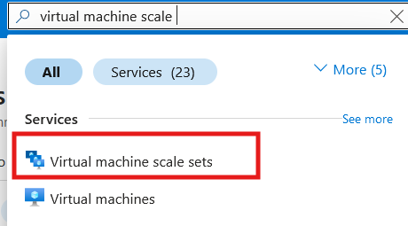
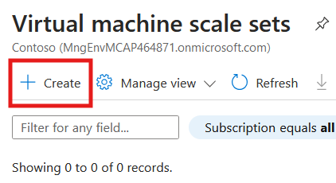

3. Provide the following details:
    - **Subscription:** Select your active subscription.
    - **Resource Group:** Choose an existing resource group or create a new one.
    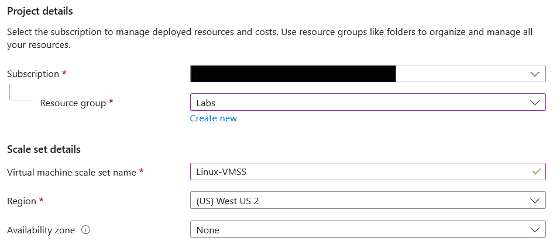
    - **Name:** Enter a unique name for the scale set (e.g., Linux-VMSS).
    - **Region:** Select the region where the scale set will be deployed.
    - **Image:** Select a Linux OS image, such as Ubuntu Server 24.04 LTS.
    - **Size:** Choose an appropriate size for the VM instances (e.g., Standard B1s).
    - **Authentication Type:** Select SSH Public Key or Password, depending on your preferred authentication method.
    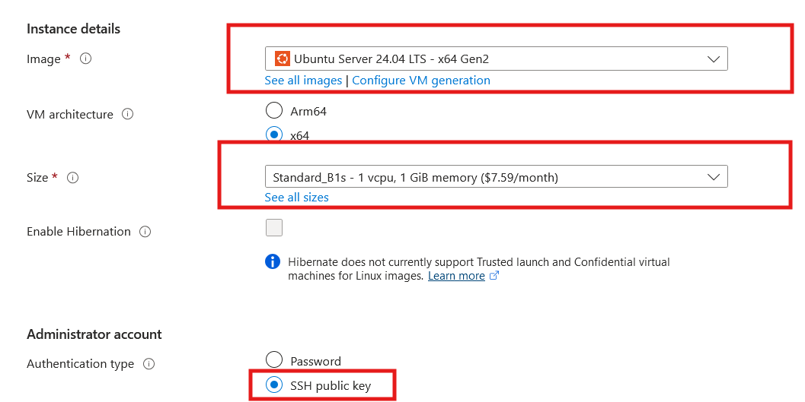
4. In the Scaling section, select Manual scaling (change the instance count as per the requirement) or Automatic scaling(handles instance count automatically) depending on your use case. For automatic scaling, you can configure rules based on metrics like CPU utilization.
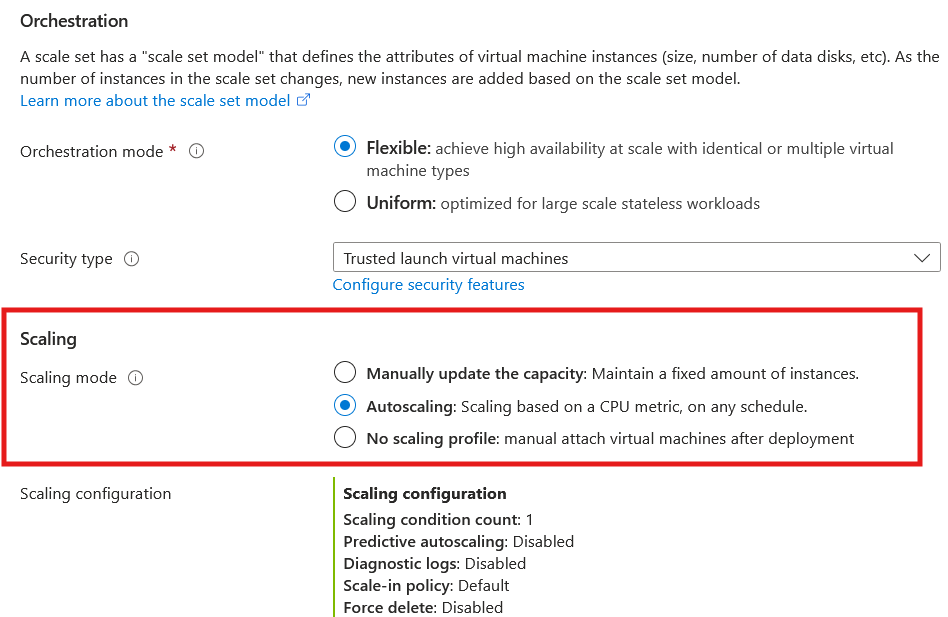
5. Click Review + Create, then click Create to provision the scale set.
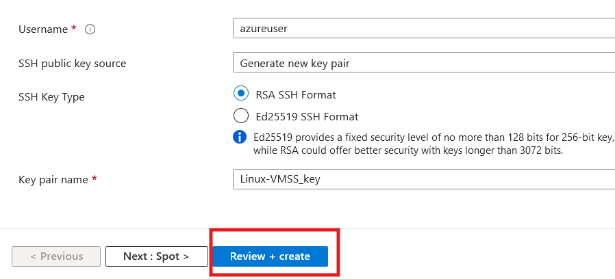
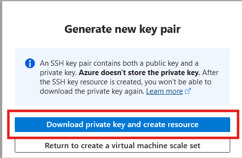
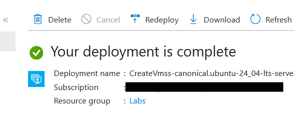

### Task 2: Scale VM Instances in the Scale Set

**Objective:** Scale the number of VM instances up or down based on demand.

**Instructions:**

1. In the Azure Portal, go to your Virtual Machine Scale Set.
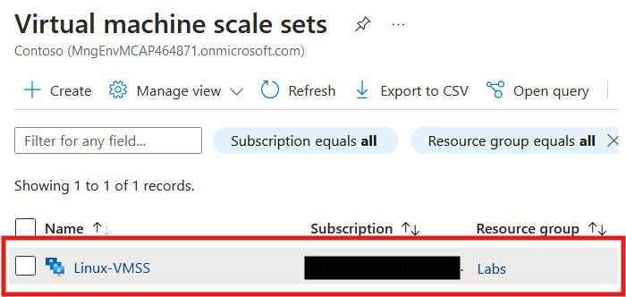
2. Under Instances, navigate to Availability + Scale select scaling, select Scaling and choose the number of instances you want to deploy. For example, change the instance count to 2.
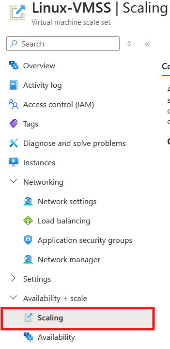
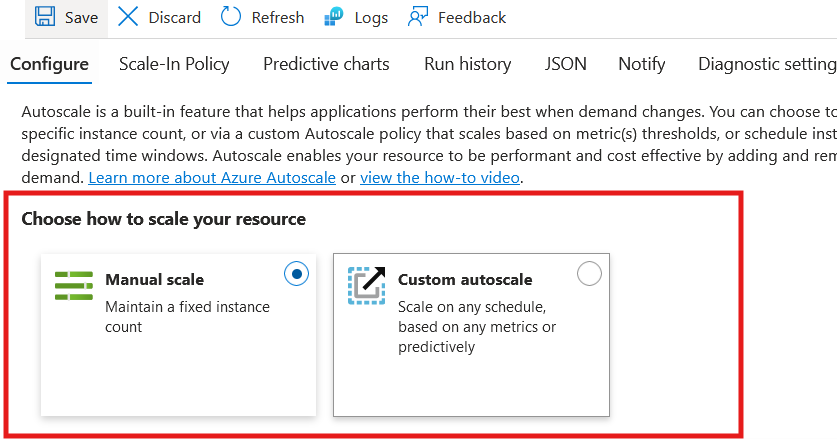
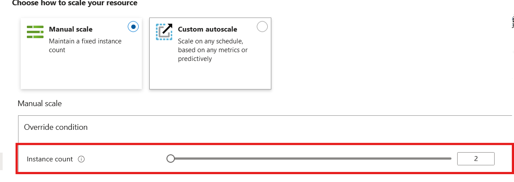
3. Click Save to apply the changes and scale out the number of VM instances.
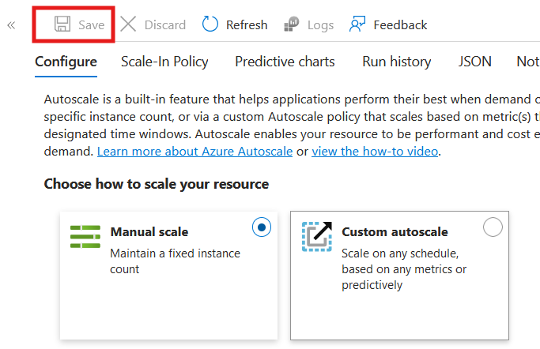
4. Monitor the scaling action to ensure that the VMs are added or removed as per the desired configuration.
5. Optionally, set up auto-scaling rules to adjust the instance count automatically based on metrics such as CPU utilization or incoming traffic.

### Task 3: Verify the VMSS Configuration

**Objective:** Verify that the VM Scale Set and load balancer are functioning correctly.

**Instructions:**

1. Navigate to the Virtual Machine Scale Set in the Azure Portal.

2. Confirm that the scale set has the desired number of VM instances.
3.  Verify the health and running status of each VM instance in the scale set. 
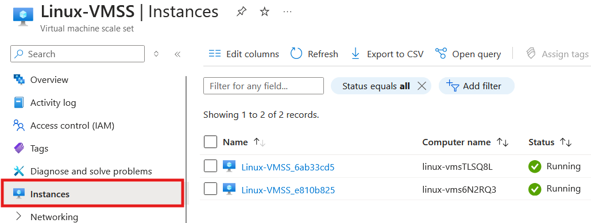
4. Take a screenshot showing the scaling configuration and the number of instances running.

### Task 4: Cleanup Resources

**Objective:** Delete the resources created during the lab to avoid unnecessary costs. 

 **Instructions:** 
 1. Navigate to the **Resource Group** used for this lab in the Azure Portal. 
 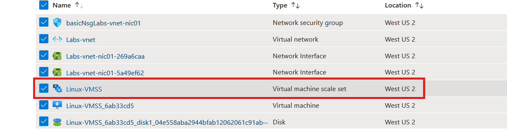
 2. Select the **Virtual Machine Scale Set**, click **Delete**, and confirm the deletion.
 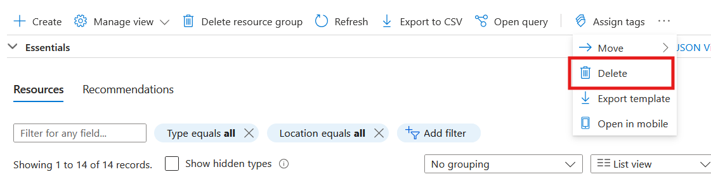
  3. Ensure that all associated resources, such as virtual networks and load balancers, are also deleted. 
  4. Finally, delete the resource group itself by selecting **Delete Resource Group** and typing the name of the resource group to confirm. 
  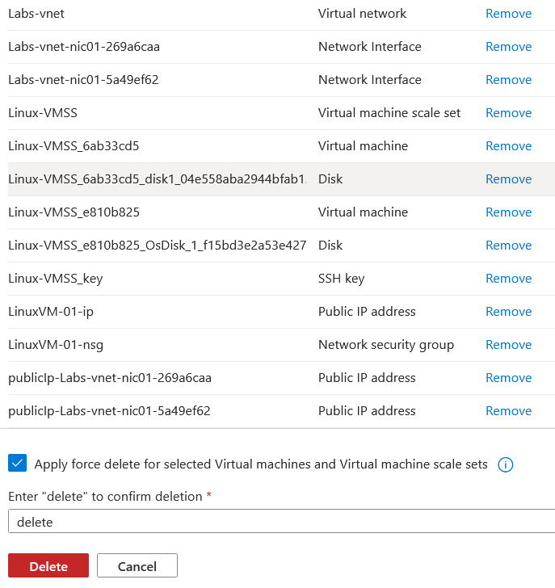

## Submission Guidelines

- Submit a screenshot of the Virtual Machine Scale Set showing the number of VM instances running and their configurations.
- Include a brief explanation of how scaling works in VMSS.
- Upload the screenshot and description to the designated submission portal.

## Additional Resources

- [Azure Documentation: Virtual Machine Scale Sets](https://docs.microsoft.com/azure/virtual-machine-scale-sets/)
- [Azure CLI Reference for Scale Sets](https://docs.microsoft.com/cli/azure/vmss)